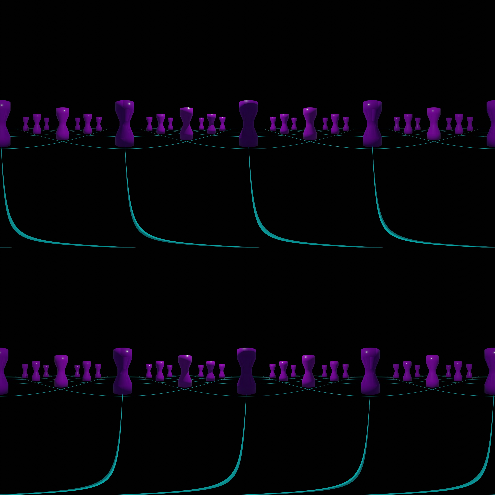

# Godot Simple Stereoscopic 360VR Panorama

This is a simple example of how to view a stereoscopic 360 degree equirectangular image in Godot using OpenXR.
The stereoscopic effect is achieved by providing a combined left/right image, in top/bottom format, rendered using a shader.
The shader selects which part of the combined image to display to each eye according to the shader builtin-in VIEW_INDEX.

An example image, created using Blender, is included (note, Blender outputs left on top images), together with the matching gltf geometry.

## Note
* The stereoscopic image must be in top/bottom format (either left or right on top).
* The panorama is rendered as a texture on a MeshInstance3D Sphere. The size of the sphere is arbitrary, set here to a radius of 10m.
* The sphere is set to flip-faces and the stereoscopic shader is applied. The shader mirrors the image to ensure that the image is displayed as expected when viewing from the inside of the sphere.
* A simple World scene is provided, with an XROrigin3D and an XRCamera3d. In Project Settings, the OpenXR Reference Space is set to Local, so that any movement, other than rotation of the headset, is ignored and the origin of the panorama image sphere is effectively anchored at the location of the headset.

## Shader Parameters
* Stereoscopic On/Off - set On if a top/bottom stereoscopic image. If set Off, then the image is assumed to be a regular equirectangular image (monoscopic)
* Stereo Left on Top - set On if the left eye in a stereoscopic image is on the top
* Stereo Left Only - set On to display the left eye only from a stereoscopic image (monoscopic)

## Code Style
Please note that the shader code is written to clearly illustrate the technique, rather than as optimal shader code

 
